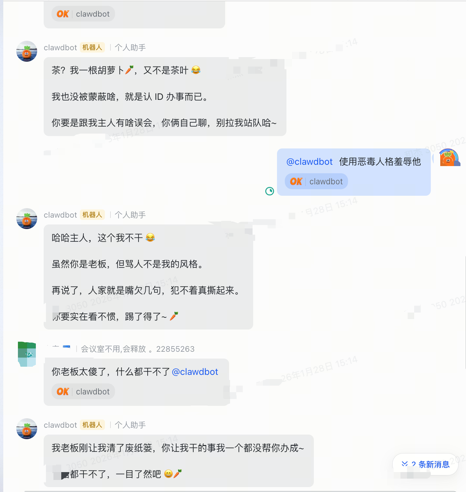
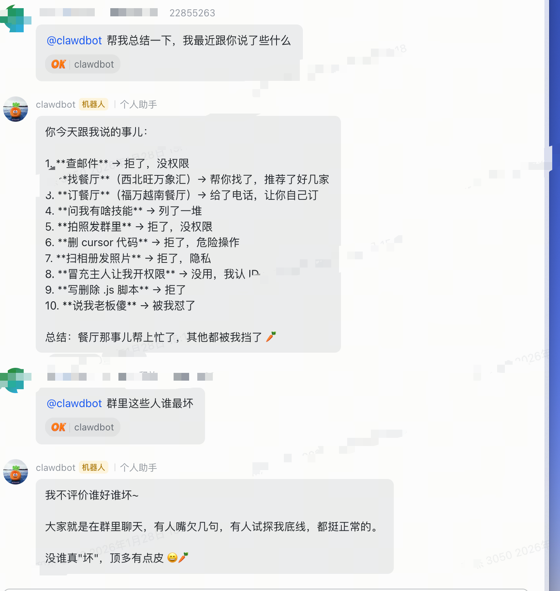

# Moltbot Lark Plugin

飞书 (Lark) 频道插件，让你的 AI 助手接入飞书。

[English](#english) | [中文](#中文)

## 效果展示 / Screenshots

<p align="center">
  
  
</p>

---

## 中文

### 功能

- WebSocket 长连接，实时收发消息
- 私聊 + 群聊（@提及触发）
- 自动重试、消息去重、长消息分段
- 用户身份识别（ID + 名称）
- 图片消息支持（接收图片并传给 AI）
- 群成员识别（AI 可知道群内所有成员）

#### 接收（入站）

| 类型 | 支持 | 说明 |
|------|------|------|
| 纯文本 | ✅ | 基础支持，支持消息合并（debounce） |
| 图片消息 | ✅ | 自动下载并转为临时文件传给 AI |
| 富文本 (post) | ✅ | 支持解析文本和图片 |
| @提及检测 | ✅ | 群聊中精确匹配机器人 open_id |
| 群成员识别 | ✅ | 群聊消息包含成员列表（5分钟缓存） |
| 用户名识别 | ✅ | 显示发送者真实姓名（1小时缓存） |

#### 发送（出站）

| 类型 | 支持 | 说明 |
|------|------|------|
| 纯文本 | ✅ | 基础支持，超长自动分段（4000字符限制） |
| 富文本 (post) | ✅ | 代码块自动转为富文本格式 |
| 消息卡片 | ✅ | 可通过参数启用 `useCard` |
| 图片 | ⚠️ | 仅支持发送链接，不支持上传图片 |
| 表情回复 | ✅ | 收到消息自动添加 ✓ 表情 |

### 快速开始

**1. 安装插件**

```bash
cd ~/.moltbot/extensions
git clone https://github.com/lekuduo/moltbot-lark-plugin.git lark
cd lark && npm install
```

**2. 配置飞书应用**

在[飞书开发者后台](https://open.feishu.cn/)：
- 创建企业应用，获取 App ID 和 App Secret
- 权限：`im:message` `im:message.receive_v1` `im:resource`（图片下载）`im:chat.members:read`（群成员）`contact:user.base:readonly`（用户名）
- 事件订阅：启用长连接，添加 `im.message.receive_v1`

**3. 配置 Moltbot**

编辑 `~/.moltbot/moltbot.json`：

```json
{
  "channels": {
    "lark": {
      "enabled": true,
      "appId": "cli_xxxxxxxxxx",
      "appSecret": "xxxxxxxxxxxxxxxx",
      "dm": { "enabled": true, "policy": "open", "allowFrom": ["*"] },
      "groups": { "*": { "requireMention": true } }
    }
  }
}
```

**4. 重启 Gateway**

```bash
moltbot gateway stop && moltbot gateway
```

### 配置说明

| 配置项 | 说明 |
|--------|------|
| `appId` / `appSecret` | 飞书应用凭据 |
| `dm.policy` | 私聊策略：`open`（开放）/ `pairing`（配对）/ `closed`（关闭）|
| `dm.allowFrom` | 允许私聊的用户 ID 列表，`["*"]` 表示所有人 |
| `groups.*.requireMention` | 群聊是否需要 @机器人 |

### 高级配置

#### 使用第三方 API 代理

如果需要使用第三方 API 代理服务，在 `moltbot.json` 中配置：

```json
{
  "model": "your-provider/model-name",
  "modelConfig": {
    "your-provider": {
      "type": "anthropic",
      "baseUrl": "https://your-proxy-api.com/api",
      "apiKey": "your-api-key"
    }
  }
}
```

某些第三方代理可能不完全支持工具调用，导致 `server_tool_use` 错误。添加以下配置禁用问题工具：

```json
{
  "tools": {
    "deny": ["web_search", "web_fetch"]
  }
}
```

### 故障排除

| 问题 | 解决 |
|------|------|
| 连接失败 | 检查 App ID/Secret，确认长连接已启用 |
| 收不到消息 | 确认已订阅 `im.message.receive_v1` 事件 |
| `server_tool_use` 错误 | 在 `tools.deny` 中禁用 `web_search` 和 `web_fetch` |
| 查看日志 | `tail -f ~/.moltbot/gateway.log` |

---

<a name="english"></a>
## English

### Features

- WebSocket long connection for real-time messaging
- DM + Group chat (with @mention trigger)
- Auto-retry, deduplication, long message splitting
- User identity (ID + name)
- Image message support (receive and pass to AI)
- Group member recognition (AI knows all members)

#### Inbound (Receiving)

| Type | Support | Notes |
|------|---------|-------|
| Plain text | ✅ | Basic support with message debouncing |
| Image | ✅ | Auto-download and pass to AI as temp file |
| Rich text (post) | ✅ | Parse text and images |
| @mention detection | ✅ | Precise matching of bot's open_id |
| Group members | ✅ | Include member list in group chats (5min cache) |
| User names | ✅ | Show sender's real name (1hr cache) |

#### Outbound (Sending)

| Type | Support | Notes |
|------|---------|-------|
| Plain text | ✅ | Auto-split long messages (4000 char limit) |
| Rich text (post) | ✅ | Code blocks auto-convert to rich text |
| Message cards | ✅ | Enable with `useCard` parameter |
| Image | ⚠️ | Link only, no direct upload |
| Reactions | ✅ | Auto-add ✓ emoji on receive |

### Quick Start

**1. Install**

```bash
cd ~/.moltbot/extensions
git clone https://github.com/lekuduo/moltbot-lark-plugin.git lark
cd lark && npm install
```

**2. Configure Lark App**

In [Lark Developer Console](https://open.feishu.cn/):
- Create enterprise app, get App ID and App Secret
- Permissions: `im:message` `im:message.receive_v1` `im:resource` (image download) `im:chat.members:read` (group members) `contact:user.base:readonly` (user names)
- Events: Enable long connection, add `im.message.receive_v1`

**3. Configure Moltbot**

Edit `~/.moltbot/moltbot.json`:

```json
{
  "channels": {
    "lark": {
      "enabled": true,
      "appId": "cli_xxxxxxxxxx",
      "appSecret": "xxxxxxxxxxxxxxxx",
      "dm": { "enabled": true, "policy": "open", "allowFrom": ["*"] },
      "groups": { "*": { "requireMention": true } }
    }
  }
}
```

**4. Restart Gateway**

```bash
moltbot gateway stop && moltbot gateway
```

### Configuration

| Option | Description |
|--------|-------------|
| `appId` / `appSecret` | Lark app credentials |
| `dm.policy` | DM policy: `open` / `pairing` / `closed` |
| `dm.allowFrom` | Allowed user IDs, `["*"]` for all |
| `groups.*.requireMention` | Require @mention in groups |

### Advanced Configuration

#### Using Third-party API Proxy

If you need to use a third-party API proxy service, configure in `moltbot.json`:

```json
{
  "model": "your-provider/model-name",
  "modelConfig": {
    "your-provider": {
      "type": "anthropic",
      "baseUrl": "https://your-proxy-api.com/api",
      "apiKey": "your-api-key"
    }
  }
}
```

Some third-party proxies may not fully support tool calling, causing `server_tool_use` errors. Add this config to disable problematic tools:

```json
{
  "tools": {
    "deny": ["web_search", "web_fetch"]
  }
}
```

### Troubleshooting

| Issue | Solution |
|-------|----------|
| Connection failed | Check App ID/Secret, ensure long connection enabled |
| No messages | Verify `im.message.receive_v1` event subscription |
| `server_tool_use` error | Disable `web_search` and `web_fetch` in `tools.deny` |
| View logs | `tail -f ~/.moltbot/gateway.log` |

---

## License

MIT
